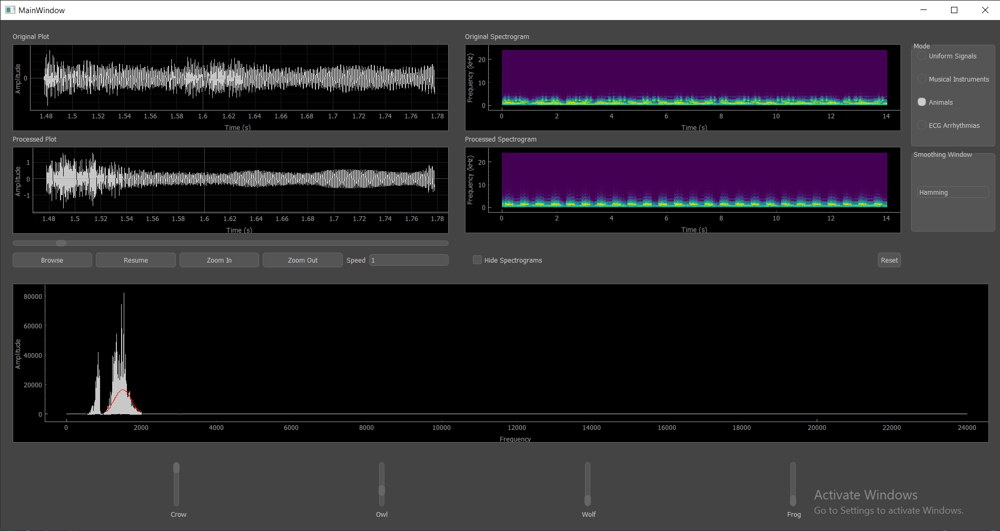

# Equalizer

## Overview

The Signal Equalizer Application is a desktop program designed to open a signal and provide the user with the ability to modify the magnitude of specific frequency components using sliders. The application operates in various modes, allowing users to manipulate signals with different characteristics, such as uniform range, musical instruments, animal sounds, and ECG abnormalities. Additionally, users can apply different multiplication/smoothing windows to customize the equalization process.

## Features

### Equalizer Modes

1. **Uniform Range Mode**
   - Divide the total frequency range into 10 equal ranges controlled by individual sliders.
   - A synthetic signal file is provided for validation, comprising pure single frequencies across the entire frequency range.

2. **Musical Instruments Mode**
   - Control the magnitude of specific musical instruments in a signal mixture containing four different instruments.

3. **Animal Sounds Mode**
   - Adjust the magnitude of specific animal sounds in a mixture of four different animal sounds.

4. **ECG Abnormalities Mode**
   - Utilize four ECG signals (one normal and three with specific arrhythmias).
   - Adjust the magnitude of arrhythmia components using sliders.

### Smoothing Windows

- Choose from four multiplication/smoothing windows: Rectangle, Hamming, Hanning, and Gaussian.

### User Interface

- Switch easily between modes using radio buttons.
- Dynamic UI adaptation with changes in modes (varying slider captions and potentially slider count).
- Sliders for adjusting frequency component magnitudes.
  
#### Signal Viewers

- Two linked cine signal viewers (input and output) with full functionality panel.
  - Play/Stop/Pause/Speed Control/Zoom/Pan/Reset.
  - Linked viewers show the same view of the signal in time and magnitude directions.

#### Spectrograms

- Two spectrograms (input and output) reflecting changes made by equalizer sliders.
- Option to toggle show/hide of the spectrograms.
